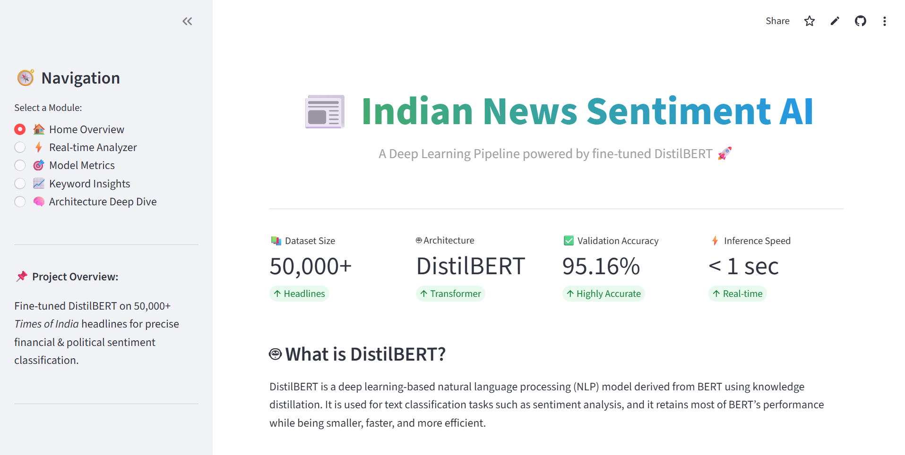

# 📰 Deep Learning News Headline Sentiment Analyzer

A powerful **Deep Learning-based NLP project** that analyzes the sentiment of news headlines and classifies them as **Positive, Negative, or Neutral**.

---

## 🚀 Project Overview

This project focuses on applying **Natural Language Processing (NLP)** and **Deep Learning techniques** to understand the emotional tone of news headlines.

News headlines often influence public perception, and sentiment analysis helps in identifying whether the news conveys a **positive, negative, or neutral sentiment**.

---

## 🧠 Features

- 🔍 Sentiment classification of news headlines  
- 🤖 Deep Learning model for accurate predictions  
- 📊 Clean and preprocessed dataset  
- ⚡ Fast and user-friendly interface  
- 📈 Real-time prediction capability  
- 🖥️ Interactive UI  

---

## 🖼️ Project UI



---

## 🛠️ Tech Stack

- **Python**
- **TensorFlow / Keras**
- **NumPy & Pandas**
- **NLTK (NLP)**
- **Matplotlib / Seaborn**

---

## 📂 Project Structure

```
Deep_Learning_News_Headline_Sentiment_Analyzer/
│── assets/
│   └── HomePage.png
│── dataset/
│── model/
│── notebooks/
│── src/
│── app.py
│── requirements.txt
│── README.md
```

---

## ⚙️ Installation & Setup

### 1️⃣ Clone the repository
```bash
git clone https://github.com/aditya-kumar-patraan1/Deep_Learning_News_Headline_Sentiment_Analyzer.git
cd Deep_Learning_News_Headline_Sentiment_Analyzer
```

### 2️⃣ Create virtual environment (optional)
```bash
python -m venv venv
source venv/bin/activate   # Linux/Mac
venv\Scripts\activate      # Windows
```

### 3️⃣ Install dependencies
```bash
pip install -r requirements.txt
```

---

## ▶️ How to Run

```bash
python app.py
```

Open in browser:
```
http://localhost:5000
```

---

## 📊 Model Workflow

1. Data Collection  
2. Data Cleaning & Preprocessing  
3. Tokenization  
4. Model Training  
5. Evaluation  
6. Prediction  

---

## 🧪 Example

**Input:**
```
Stock market crashes due to global recession fears
```

**Output:**
```
Negative 😟
```

---

## 📈 Future Improvements

- 🔹 Integrate real-time news API  
- 🔹 Use advanced models like BERT  
- 🔹 Deploy on cloud (AWS / Render / Vercel)  
- 🔹 Add multilingual support  

---

## 🤝 Contributing

1. Fork the repo  
2. Create a new branch  
3. Commit changes  
4. Open a Pull Request  

---

## 📜 License

This project is licensed under the MIT License.

---

## 👨‍💻 Author

**Aditya Kumar**

GitHub: https://github.com/aditya-kumar-patraan1  

---

## ⭐ Support

If you like this project, give it a ⭐ on GitHub!